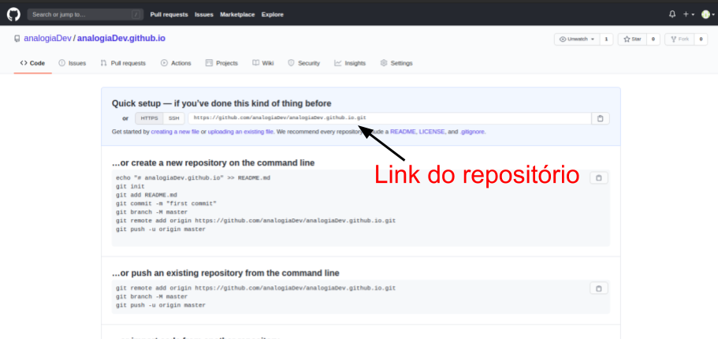
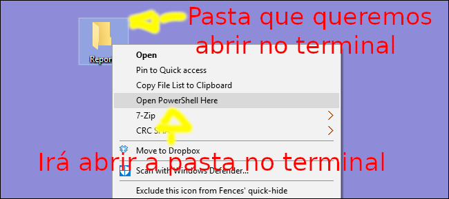
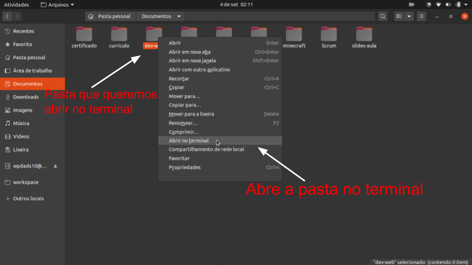
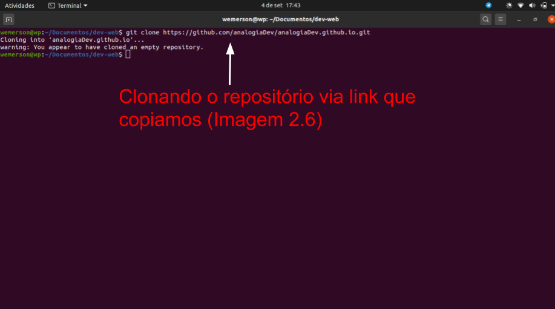

<!-- Descrever tutorial...[link](#) -->
## O que é Github e Github pages?

**GitHub** é um sistema que tem como principal intuito o gerenciamento de projetos e versões de código. Porém, além do seu foco principal, ele oferece vários outros serviços desde o **Github pages** até mesmo ser uma rede social de desenvolvedores.

Já o **GitHub pages** como foi apresentado, é um dos serviço oferecidos pelo github, onde de forma rápida e simples é possível hospedar gratuitamente sites direto dos seus **repositórios** no Github. **Repositório** é a pasta raiz do seu projeto, onde todos os arquivos necessários para o projeto ficam dentro do mesmo.

## 1 - Criando uma conta no Github

De forma rápida e prática, acesse [github.com](https://github.com/) e clique em **Sign up (inscrever-se)**, como mostra a imagemm 1.1.

Imagem 1.1 - Clicando em Sign up (inscrever-se).

Depois basta preencher todos os campos e efetuar **Sign in (login)**, então estamos prontos para continuar.

## 2 - Criando e publicando sua página pessoal no Github Pages

Após estar logado no Github, vamos criar o nosso repositório clicando em **new**, como na imagem 2.1.

Imagem 2.1 - Criando um novo repositório

Em seguida irá aparecer uma tela como na imagem 2.2.

Imagem 2.2 - Estrutura para criação de um repositório

Em **Repository name (Nome do repositório)** devemos especificar um nome para nosso site como mostra a imagemm 2.3, porém para que seja possível )ativar) o github pages, é necessário que o repositório seja nomeado com **user-name.github.io**, onde devemos substituir **user-name** por o seu nome de usuário. Caso não lembre seu nome de usuário, ele é o valor contído no campo **Owner** como mostra a imagem 2.3.

Imagem 2.3 - Nome do repositório

No github os repositórios podem ser públicos ou privados. A principal diferença entre os dois tipos são a sua vizualização, onde o público qualquer pessoa pode o vizualizar, já o privado só é possível por pessoas com sua autorização. No caso do Github pages, é preciso que seu repositório seja público, por isso vamos marcar a opção **Public (Público)** como na figura 2.4.

Imagem 2.4 - Selecionando Public (Público)

Após isso, clique em **create repository (Criar repositório)** para que o seu repositório seja criado. Em seguida irá aparecer uma tela como a imagemm 2.5.

Imagem 2.5 - Configurações inicias do projeto

Vamos **copiar o link do repositório**, para que seja possível **clonar** o mesmo.

Imagem 2.6 - Copiando o link do repositório

Vá até a pasta no qual você irá salvar o projeto, clique com o botão direito e selecione a opção **Open Powershell here** no **windows** (Imagem 2.7) ou **Abrir no terminal** no **linux** (Imagem 2.8).

Imagem 2.7 - Abrindo pasta no terminal do windows

Imagem 2.8 - Abrindo pasta no terminal do linux

Agora vamos **clonar** nosso repositório para que seja possível baixá-lo e editá-lo em qualquer lugar. Para clonar o repositório é preciso ter o Git instalado na sua máquina, caso não tenha basta acessar [git.com](https://git-scm.com/downloads), faça o download e o instale. Com o git na sua máquina e com o terminal que abrimos no passo anterior, digite ``git clone link-do-repositório`` (Imagem 2.9), onde deve-se subistituir ``link-do-repositorio`` por o link do seu repositório (imagem 2.6), por fim teremos baixado no nosso computador a pasta raiz do projeto.

imagem 2.9 - Clonando o repositório

Após ter clonado, é possível vizualizar o repositório do projeto acessando a pasta que você escolheu ou apenas utilizando o comando `dir` no windows e `ls` no linux. 